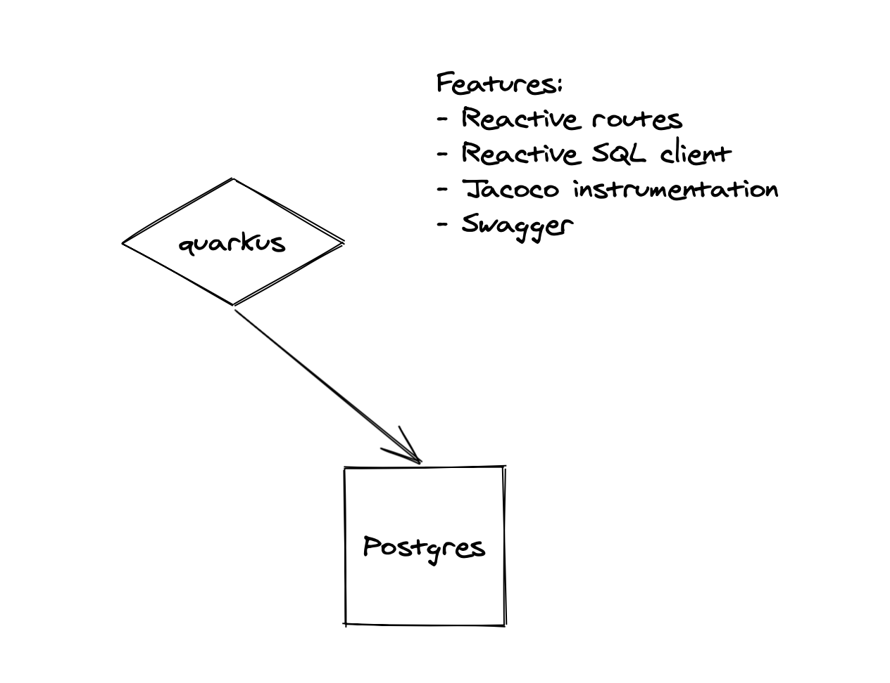

[](https://opensource.org/licenses/MIT)

# Quarkus

### Project diagram



### Setup environment

You should create an instance of Postgres database with some sample data. You can do that by running:

```shell script
docker-compose up -d
```

### Running the application in dev mode

You can run your application in dev mode that enables live coding using:
```shell script
./mvnw compile quarkus:dev
```

### Packaging and running the application

The application can be packaged using:
```shell script
./mvnw package
```
It produces the `quarkus-1.0.0-SNAPSHOT-runner.jar` file in the `/target` directory.

The application is now runnable using `java -jar target/quarkus-1.0.0-SNAPSHOT-runner.jar`.

### Creating a native executable

You can create a native executable using: 
```shell script
./mvnw package -Pnative
```

Or, if you don't have GraalVM installed, you can run the native executable build in a container using: 
```shell script
./mvnw package -Pnative -Dquarkus.native.container-build=true
```

You can then execute your native executable with: `./target/quarkus-1.0.0-SNAPSHOT-runner`

### Swagger

The swagger documentation could be found at:

```shell script
http://localhost:8088/swagger-ui
```

### License
MIT License. [Click here for more information.](LICENSE)
